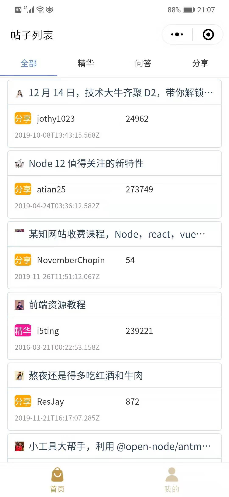
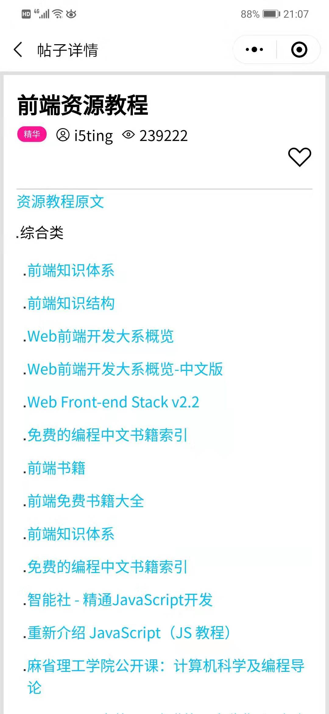

# cnodeYuan
项目是基于Taro开发的小程序，使用cnode开源的api接口搭建的一个小程序demo

## 从仓库克隆代码
```
git clone https://github.com/yuanzhiyong123/cnodeYuan.git
```

## 本地开发
```
npm install
npm run dev:weapp
```

## 打包
```
npm run build:weapp
```
## 实现的功能
 - [x] 帖子列表展示，tab切换不同类型
- [x] 帖子详情展示 wxParse转换markdown to wxml
- [x] 登录 登出
- [x] 帖子收藏、取消收藏
- [x] 我的收藏


## 小程序截图




